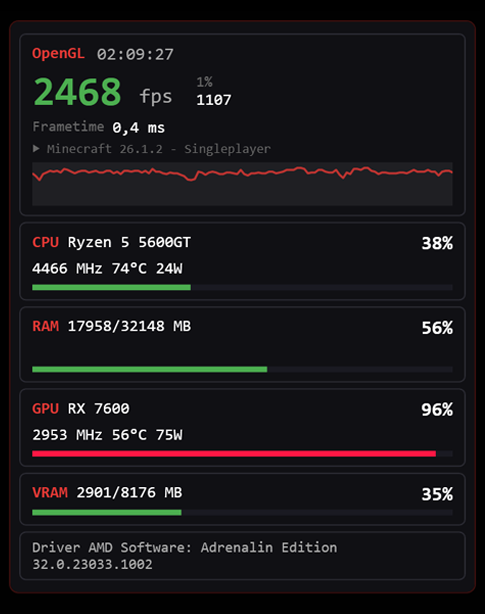
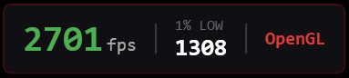
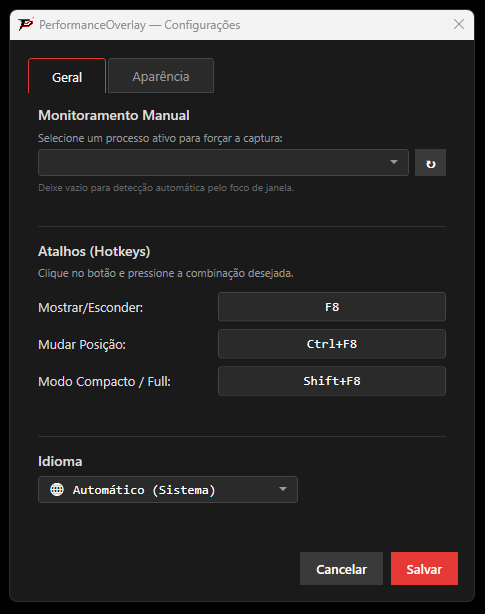
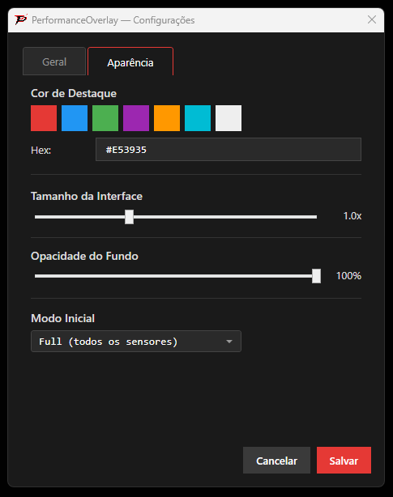

<div align="center">

# 🎮 PerformanceOverlay

### Real-time gaming metrics with zero performance impact.

[](https://dotnet.microsoft.com/download/dotnet/8.0)
[](https://www.microsoft.com/windows)
[](LICENSE)
[](#-anticheat--segurança)

**Monitoramento de FPS, frametime, CPU, GPU e RAM em tempo real — direto do Kernel do Windows.**
**Sem hooks. Sem injeção. Sem risco de banimento.**

[📥 Download](#-instalação) · [📸 Screenshots](#-screenshots) · [🛠 Como Funciona](#-o-coração-do-app--etw-kernel-tracing) · [🌍 Idiomas](#-idiomas)

</div>

---

## ✨ Funcionalidades

| Recurso | Descrição |
|---|---|
| **FPS em Tempo Real** | Captura precisa via ETW (Event Tracing for Windows) — mesma técnica do PresentMon e CapFrameX |
| **1% Low FPS** | Identifica micro-stutters que o FPS médio esconde |
| **Gráfico de Performance** | Visualização instantânea: FPS alto = topo, queda = mergulho. Dados brutos, sem suavização |
| **CPU / GPU / RAM / VRAM** | Uso, temperatura, clock e consumo de energia — como o Task Manager, mas no jogo |
| **Detecção de API** | Identifica automaticamente DirectX 9/11/12, Vulkan e OpenGL |
| **Modo Compacto** | Apenas FPS + 1% Low + API — ocupa ~100px de largura |
| **Hotkeys Globais** | F8 toggle, Ctrl+F8 posição, Shift+F8 modo — reconfiguráveis |
| **6 Idiomas** | 🇬🇧 EN · 🇧🇷 PT · 🇪🇸 ES · 🇫🇷 FR · 🇩🇪 DE · 🇨🇳 ZH — detecção automática do sistema |
| **Opacidade Seletiva** | Fundo translúcido, texto sempre 100% legível |
| **Título da Janela** | Exibe "Minecraft 1.12.1 - Singleplayer" em vez de "javaw" |

---

## 📸 Screenshots

<div align="center">

| Modo Completo | Modo Compacto |
|---|---|
|  |  |

| Configurações — Geral | Configurações — Aparência |
|---|---|
|  |  |

</div>

> 💡 *Substitua os placeholders acima pelas capturas reais da sua tela.*

---

## 🧠 O Coração do App — ETW Kernel Tracing

A maioria dos overlays de FPS usa **hooks DirectX** (interceptação de chamadas de API) ou **DLL injection** para capturar frames. Essas técnicas são invasivas, detectáveis por anticheats, e adicionam latência ao pipeline de renderização.

O PerformanceOverlay usa uma abordagem fundamentalmente diferente: **Event Tracing for Windows (ETW)** — o mesmo sistema de instrumentação que o Windows usa internamente para o Task Manager, o PresentMon da Intel e o CapFrameX.

```
┌─────────────┐     ┌──────────────┐     ┌─────────────────┐
│   Jogo      │────▶│  DXGI/D3D9   │────▶│  Windows Kernel  │
│ (DX12/VK/GL)│     │  Runtime     │     │  ETW Provider    │
└─────────────┘     └──────────────┘     └────────┬────────┘
                                                   │
                                          Event ID 42 (Present)
                                                   │
                                         ┌─────────▼─────────┐
                                         │  PerformanceOverlay │
                                         │  (consumidor ETW)   │
                                         │  Leitura passiva    │
                                         └─────────────────────┘
```

**Como funciona:**

Cada vez que um jogo chama `IDXGISwapChain::Present()`, o runtime DXGI emite um evento ETW com **Event ID 42**. O PerformanceOverlay escuta esses eventos como consumidor read-only — sem modificar a memória do jogo, sem interceptar chamadas, sem tocar no pipeline de renderização.

O frametime é calculado pela diferença entre timestamps consecutivos do kernel (precisão de ~100 nanosegundos). O FPS é derivado: `FPS = count / (totalTime / 1000)`. O 1% Low usa o percentil 99 dos frametimes ordenados.

Para jogos OpenGL (como Minecraft via LWJGL), o fallback usa eventos do DxgKrnl — o driver de kernel do Windows que processa todas as APIs gráficas.

---

## 🛡 Anticheat & Segurança

O PerformanceOverlay foi projetado desde o início para ser **100% seguro contra banimentos**.

| Técnica Perigosa | PerformanceOverlay |
|---|---|
| ❌ DLL Injection | ✅ Nenhuma DLL injetada em processos |
| ❌ Hooks DirectX/Vulkan | ✅ ETW é leitura passiva do kernel |
| ❌ WriteProcessMemory | ✅ Apenas `OpenProcess(QUERY_INFO \| VM_READ)` |
| ❌ CreateRemoteThread | ✅ Zero threads criadas em outros processos |
| ❌ SetWindowsHookEx | ✅ Hotkeys via `RegisterHotKey` (API pública) |

A janela do overlay usa `WS_EX_TRANSPARENT | WS_EX_TOOLWINDOW | WS_EX_NOACTIVATE` — é invisível para anticheats como EAC, BattlEye e Vanguard porque não intercepta input nem modifica a cadeia de renderização.

> **Auditoria completa:** `grep -rn "WriteProcessMemory\|CreateRemoteThread\|SetWindowsHookEx" --include="*.cs"` retorna **zero resultados** no código fonte.

---

## 📥 Instalação

### Requisitos

- Windows 10/11 (x64)
- [.NET 8 Desktop Runtime](https://dotnet.microsoft.com/download/dotnet/8.0)
- Execução como **Administrador** (necessário para ETW e sensores de hardware)

### Passos

1. Baixe o [último release](https://github.com/seu-usuario/PerformanceOverlay/releases/latest)
2. Extraia o ZIP para qualquer pasta
3. Execute `PerformanceOverlay.exe` **como Administrador**
4. O overlay aparece no canto superior esquerdo — use **F8** para toggle

### Build do Código Fonte

```bash
git clone https://github.com/seu-usuario/PerformanceOverlay.git
cd PerformanceOverlay
dotnet build -c Release -r win-x64
```

> O executável estará em `bin/Release/net8.0-windows/win-x64/`

---

## ⌨️ Hotkeys Padrão

| Ação | Tecla | Reconfigurável? |
|---|---|---|
| Mostrar / Esconder | `F8` | ✅ |
| Mudar posição (4 cantos) | `Ctrl+F8` | ✅ |
| Modo Compacto ↔ Completo | `Shift+F8` | ✅ |

Todas as hotkeys são reconfiguráveis em **Configurações → Geral → Hotkeys**.

---

## 🌍 Idiomas

O idioma é detectado automaticamente pelo sistema operacional. Para mudar manualmente: **Configurações → Geral → Idioma**.

| Código | Idioma | Status |
|---|---|---|
| `en` | 🇬🇧 English | ✅ Completo |
| `pt` | 🇧🇷 Português | ✅ Completo |
| `es` | 🇪🇸 Español | ✅ Completo |
| `fr` | 🇫🇷 Français | ✅ Completo |
| `de` | 🇩🇪 Deutsch | ✅ Completo |
| `zh` | 🇨🇳 中文 | ✅ Completo |

---

## 🏗 Stack Técnica

| Componente | Tecnologia | Papel |
|---|---|---|
| **Runtime** | .NET 8 (x64) | Framework base |
| **UI** | WPF (XAML + C#) | Overlay transparente + Settings |
| **FPS Capture** | [Microsoft.Diagnostics.Tracing.TraceEvent](https://github.com/microsoft/perfview) | ETW consumer — captura Present events |
| **Sensores** | [LibreHardwareMonitorLib](https://github.com/LibreHardwareMonitor/LibreHardwareMonitor) | CPU/GPU temp, clock, power |
| **GPU Usage** | `PerformanceCounter("GPU Engine")` | Mesmo método do Task Manager |
| **Driver Info** | Windows Registry | Versão do driver AMD/NVIDIA/Intel |
| **Tray Icon** | [H.NotifyIcon.Wpf](https://github.com/HavenDV/H.NotifyIcon) | System tray com menu dark |
| **API Detection** | psapi.dll `EnumProcessModulesEx` | Detecção de DLLs gráficas carregadas |

### Arquitetura

```
App.xaml.cs                    ← Entry point + System Tray
├── TelemetryPipeline          ← Orquestrador (EMA + UI throttle 60Hz)
│   ├── FrameCaptureService    ← ETW session (DXGI/D3D9/DxgKrnl)
│   ├── HardwareMonitorService ← LHM + GPU Engine counters
│   ├── ForegroundTracker      ← Detecção de janela ativa + título
│   └── GraphicsApiDetector    ← Módulos + ETW Refine
├── OverlayWindow              ← HUD (Full + Compact)
├── SettingsWindow             ← Configurações (dark theme)
├── LocalizationManager        ← 6 idiomas inline
└── HotkeyService              ← Hotkeys globais com re-registro
```

---

## 🐛 Suporte & Logs

O PerformanceOverlay gera automaticamente um arquivo de log em:

```
%APPDATA%\PerformanceOverlay\overlay.log
```

Este ficheiro regista todas as informações relevantes para diagnóstico: inicialização do ETW, detecção de API, erros de sensores, registro de hotkeys e falhas de configuração.

**Para reportar um bug:**

1. Reproduza o problema
2. Localize o ficheiro `overlay.log` (cole `%APPDATA%\PerformanceOverlay` no Explorer)
3. Abra uma [Issue](https://github.com/seu-usuario/PerformanceOverlay/issues/new) e anexe o log

O log tem rotação automática (máximo 1 MB) e não contém dados pessoais.

---

## 📊 Performance do Overlay

| Métrica | Valor | Notas |
|---|---|---|
| **CPU** | < 0.15% | 1 core, medido com Process Explorer |
| **RAM** | ~45 MB | Inclui LHM + ETW buffers |
| **GPU** | 0% | Overlay WPF usa composição do DWM |
| **Latência** | 0 ms adicionais | ETW é passivo — não toca no render pipeline |

---

## 📄 Licença

Este projeto está licenciado sob a [MIT License](LICENSE).

Desenvolvido com ❤️ para a comunidade gamer.

---

<div align="center">

**Se este projeto te ajudou, deixa uma ⭐ no repositório!**

</div>
